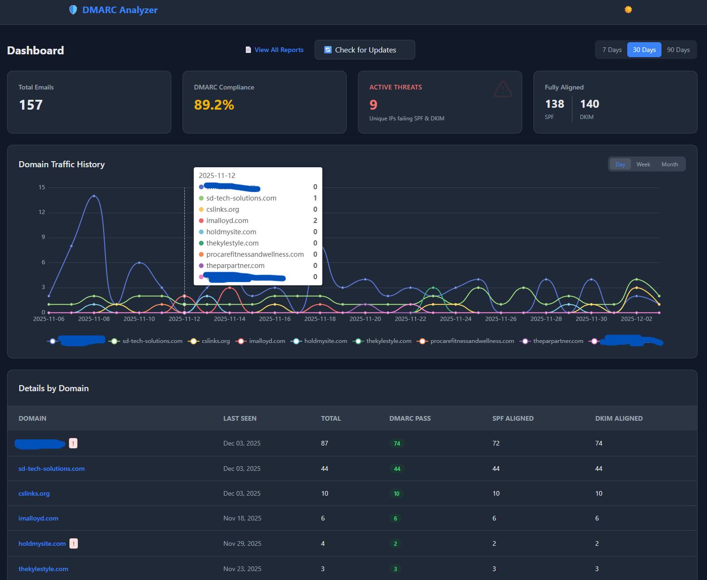

# Self-Hosted DMARC Analyzer



## Overview

**DMARC Analyzer** is a private, self-hosted security tool designed to ingest, parse, and visualize DMARC aggregate reports (RUA).

I have been implementing domain level email security for years but have never had an easy way to check it to see if anything was wrong, I would just rely on someone letting me know there was an issue. I finally built this tool for my internal use and for an easier way to keep an eye on the events happenind to my domains' emails.

Unlike commercial SaaS solutions that require you to ship sensitive email traffic data to third parties, this tool keeps your data entirely within your own infrastructure. It provides immediate actionable intelligence on email spoofing attempts, SPF/DKIM misalignments, and unauthorized IPs sending mail on your behalf.

I needed the tool, so I built it. You can use it.

### Key Features

- **Security First:** Identifies "Active Threats"—IPs failing both SPF and DKIM checks.
- **Data Sovereignty:** Your email data never leaves your server.
- **Multi-Domain Support:** Group reports by organization and domain.
- **Visualization:** Interactive charts for email volume and authentication trends.
- **Deduplication:** Smart ingestion logic prevents duplicate report data.

## Prerequisites

Before installing, ensure you have the following installed on your system:

- [Docker Desktop](https://www.docker.com/products/docker-desktop/) (or Docker Engine + Compose)
- [Git](https://git-scm.com/)

You obviously need to have your email domains setup for DMARC in order to take advantage of this.

[I can help you with that](https://sd-tech-solutions.com/)

## Installation

This application builds its own Docker images locally to ensure you have full control over the code running on your server.

### 1. Clone the Repository

Open your terminal or command prompt and run:

```bash
git clone https://github.com/clomok/dmarc-analyzer
cd dmarc-analyzer
```

### 2\. Configure Environment Variables

Create a `.env` file in the root directory. You can copy the example below:

**File:** `.env`

```Ini, TOML
# Database (TimescaleDB)
POSTGRES_DB=dmarc
POSTGRES_USER=dmarc_user
POSTGRES_PASSWORD=secure_password_here

# Django Security
SECRET_KEY=generate_a_long_random_string_here
DEBUG=False
ALLOWED_HOSTS=yourdomain.com,localhost,127.0.0.1
CSRF_TRUSTED_ORIGINS=https://dmarc.yourdomain.com

# Email Ingestion (IMAP)
EMAIL_HOST_IMAP=imap.email.com
EMAIL_HOST_USER=reports@yourdomain.com
EMAIL_HOST_PASSWORD=your_email_inbox_password
```

---

### 3\. Build and Run

Choose the instructions for your operating system.

#### 🪟 Windows (PowerShell)

The helper script `manage.ps1` is provided for easy management on Windows.

**Start the Application:**

```powershell
.\manage.ps1 dev
```

**Run Manual Ingestion:**
Use the `--limit 5` flag to ingest more or less than the default 10 per run

```powershell
.\manage.ps1 ingest --limit 5
```

**Stop the Application:**

```powershell
docker-compose down
```

#### 🍎 Mac & 🐧 Linux (Bash)

A `Makefile` is provided for standard Unix environments.

**Start the Application:**

```bash
make dev
```

**Run Manual Ingestion:**

```bash
make ingest
```

**Stop the Application:**

```bash
docker-compose down
```

## Security & Deployment Note

When deploying behind a Reverse Proxy (Nginx, Traefik, Caddy) with SSL:

1.  Ensure `CSRF_TRUSTED_ORIGINS` in your `.env` includes your `https://` domain.
2.  Ensure `ALLOWED_HOSTS` includes your domain name.

## License

MIT
